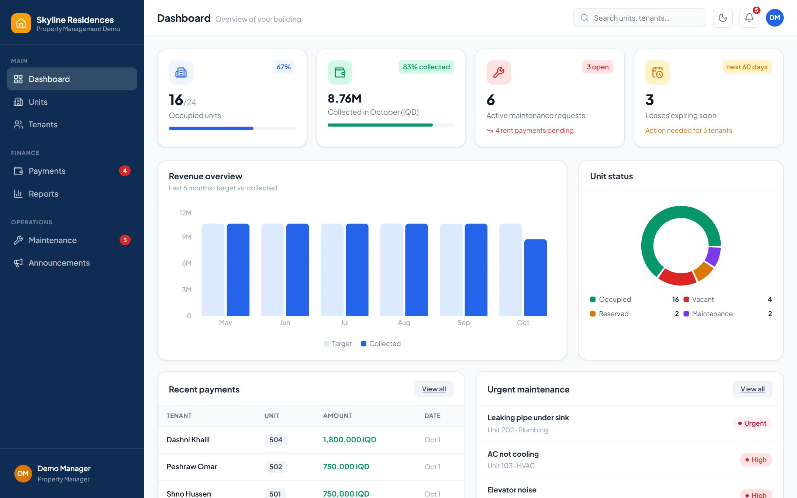
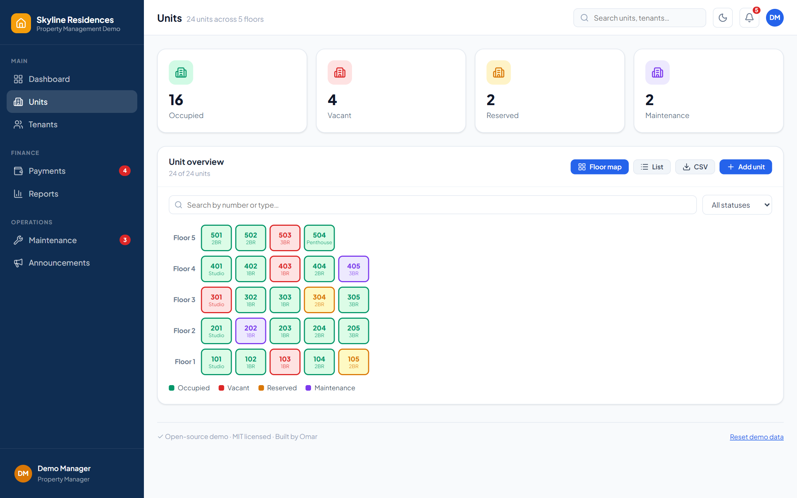
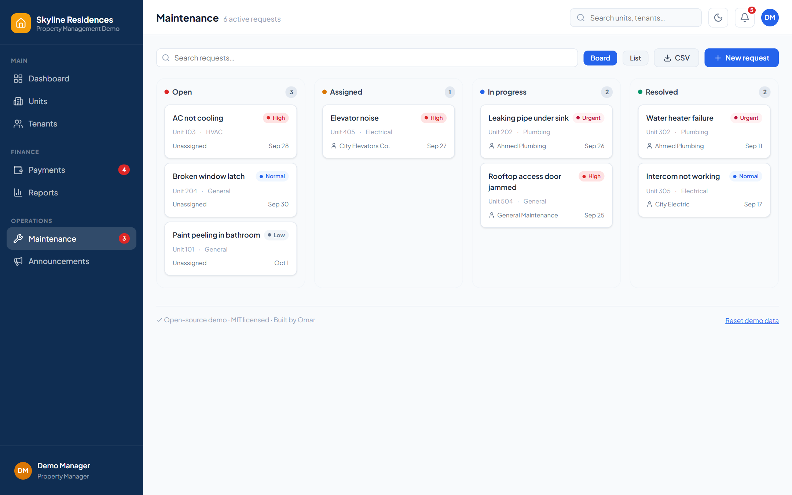
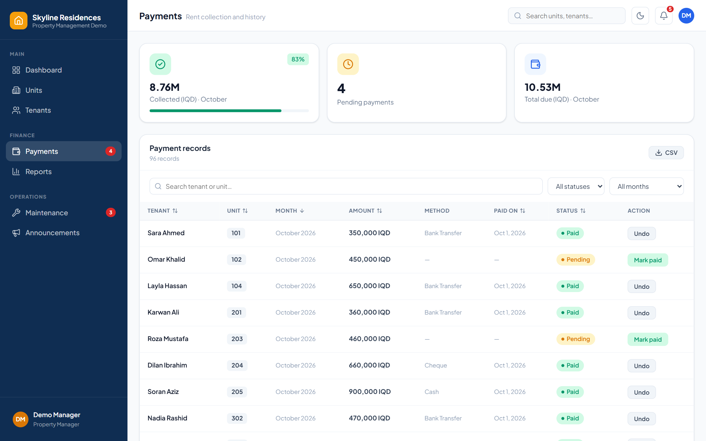
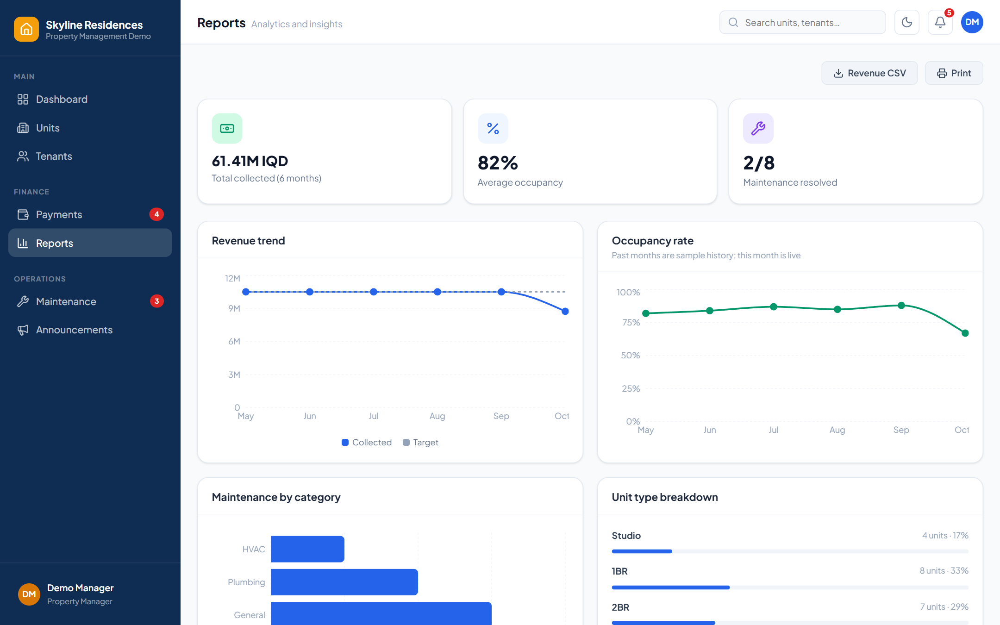
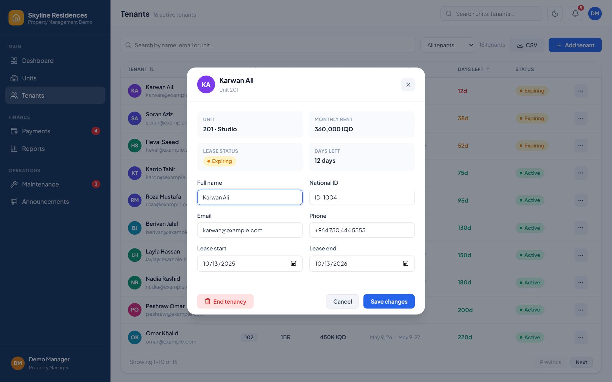
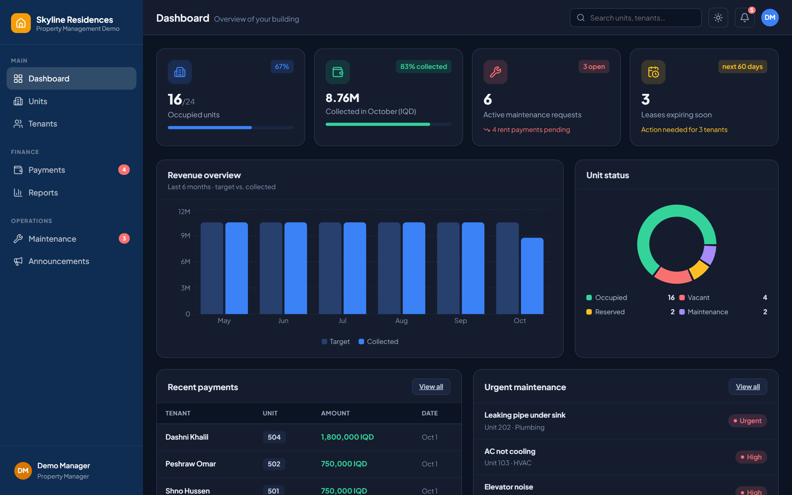
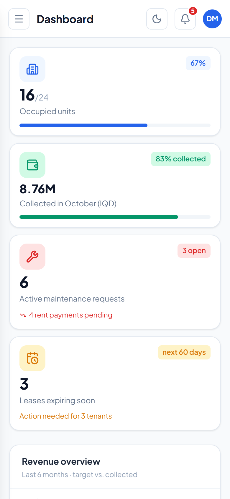
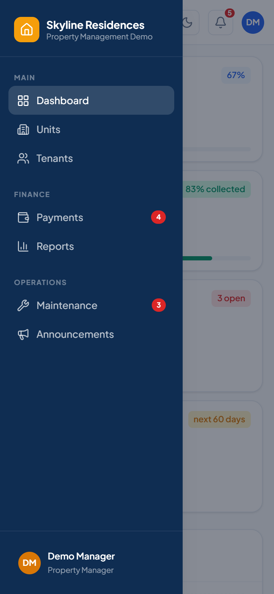
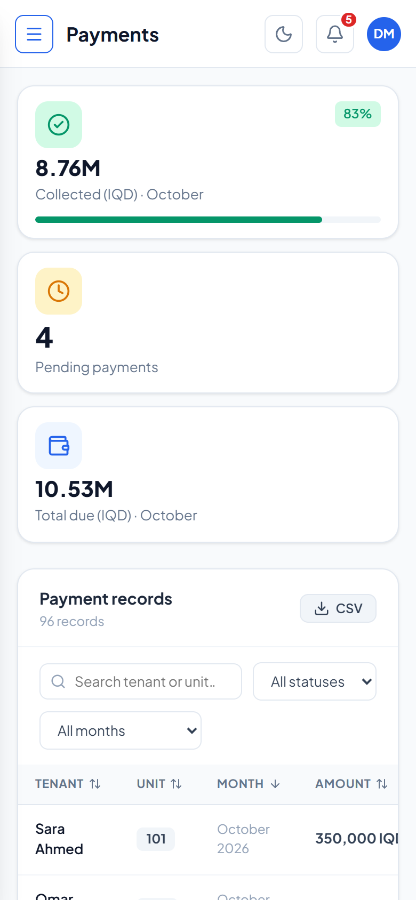

# Apartment Dashboard

A free, open-source **property management dashboard**: track units, tenants, rent collection, maintenance requests and building announcements, with charts and reports. Everything runs in the browser, with no backend and no sign-up. Your changes are saved to `localStorage`.

[](https://github.com/omarGH99/apartment-dashboard/actions/workflows/ci.yml)
[](LICENSE)

**[Live demo](https://omargh99.github.io/apartment-dashboard/)**



> All data is fictional and generated relative to today's date, so the demo never looks stale.

## Features

- **Dashboard**: occupancy, rent collected this month, active maintenance, expiring leases, revenue chart and unit-status breakdown. Every card links to the matching filtered view.
- **Units**: interactive floor map and sortable list; add, edit and delete units; filter by status.
- **Tenants**: lease tracking with days-left and expiring/expired status; add tenants (the unit is occupied and a rent invoice is created automatically) and end tenancies.
- **Payments**: monthly rent ledger, record payments with a method, undo, filter by status or month.
- **Maintenance**: drag-and-drop kanban board (or list view), create requests, assign technicians, change priority. Resolving the last request frees a unit that was under maintenance.
- **Announcements**: post, edit and delete building notices.
- **Reports**: revenue trend, occupancy, maintenance by category and unit mix, with CSV export and print styles.
- **Quality of life**: global search, notification centre, dark mode, CSV export, deep-linkable filters (`#/units?status=vacant`), responsive layout with a mobile drawer, keyboard-accessible dialogs, **Reset demo data** button.

## Screenshots

|                                                                            |                                                                                                                    |
| -------------------------------------------------------------------------- | ------------------------------------------------------------------------------------------------------------------ |
|  **Units floor map**  |  **Maintenance board** (drag cards between columns) |
|  **Payments ledger**          |  **Reports**                                                            |
|  **Tenant details** |  **Dark mode**                                                 |

<p>
  
  
  
</p>

More in [`docs/screenshots/`](docs/screenshots). Regenerate them with `npm run build && npx vite preview --port 4173` and then `npm run screenshots` (uses your installed Edge/Chrome).

## Tech stack

React 19 · TypeScript · Vite · React Router (hash routing) · Recharts · dayjs · lucide-react · Vitest + Testing Library · ESLint + Prettier

## Getting started

```bash
npm install
npm run dev        # http://localhost:5173
```

| Script              | What it does                       |
| ------------------- | ---------------------------------- |
| `npm run dev`       | Start the dev server               |
| `npm run build`     | Type-check and build to `dist/`    |
| `npm run preview`   | Serve the production build locally |
| `npm test`          | Run the unit and component tests   |
| `npm run lint`      | Lint with ESLint                   |
| `npm run typecheck` | Run the TypeScript compiler        |
| `npm run format`    | Format the code with Prettier      |

## Project structure

```
src/
  components/   Layout (sidebar, topbar, search, notifications), Modal, shared UI, toasts
  context/      AppContext (provider) and store (pure reducer + localStorage persistence)
  data/         Deterministic, date-relative seed data
  pages/        Dashboard, Units, Tenants, Payments, Maintenance, Announcements, Reports
  utils/        Selectors/statistics, formatters, CSV export, hooks
  test/         Unit tests (stats, reducer) and component tests (pages)
```

Design notes:

- **State** lives in a single `useReducer` store. The reducer is pure and fully unit-tested, and keeps related records consistent (for example, ending a tenancy frees the unit and drops its unpaid dues).
- **Derived values** (occupancy, collection rate, revenue series, lease status) are computed by pure selectors in `utils/stats.ts`, never stored.
- **Seed data** is generated from a seeded PRNG relative to "today", so the app is reproducible and never goes stale. Stored data from a previous month is regenerated automatically.
- **Hash routing** lets the app work on any static host (GitHub Pages, Netlify, Vercel) with no server rewrites.

## Deploying

The repo includes a GitHub Actions workflow that builds and publishes to **GitHub Pages** on every push to `main`. Enable it under _Settings → Pages → Source: GitHub Actions_. Because the build uses relative asset paths (`base: './'`), it also works unchanged on Netlify, Vercel or a custom domain.

## Customising

Edit [`src/config.ts`](src/config.ts) to set the building name, your name and your GitHub/website links (shown in the footer). Edit [`src/data/seed.ts`](src/data/seed.ts) to change the demo data.

## Roadmap

- Backend and auth (multi-user, real persistence)
- Lease renewal flow and PDF receipts
- Late-fee rules and overdue status
- i18n, including RTL languages (Arabic / Kurdish)

## Contributing

Issues and pull requests are welcome. See [CONTRIBUTING.md](CONTRIBUTING.md) and the [Code of Conduct](CODE_OF_CONDUCT.md). Notable changes are listed in the [CHANGELOG](CHANGELOG.md); security reports go through [SECURITY.md](SECURITY.md).

## License

[MIT](LICENSE). Free to use, modify and share.
